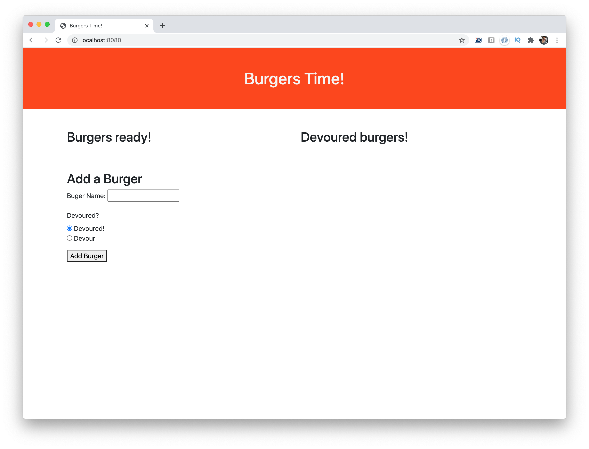
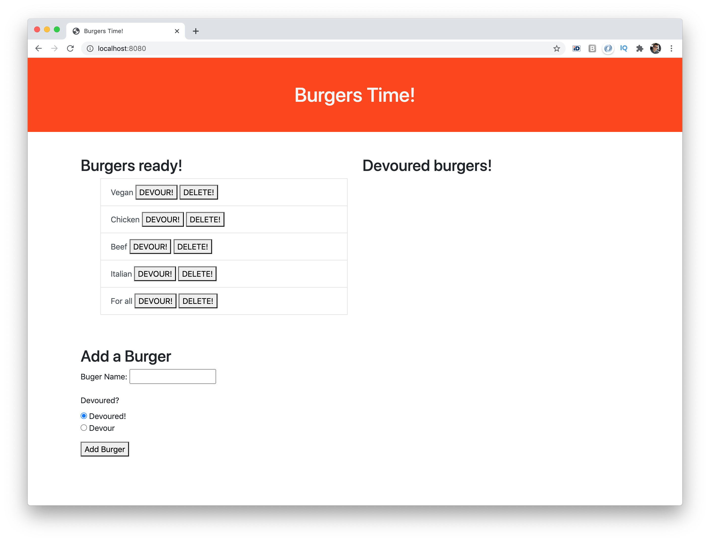
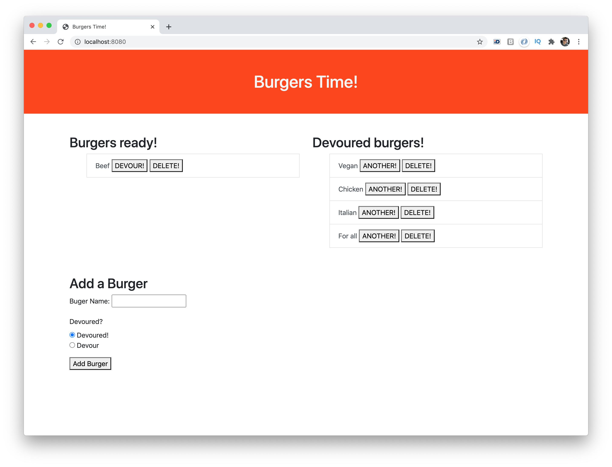

# 13_Burger

A burger logger with MySQL, Node, Express, Handlebars and a homemade ORM (yum!)

## Badges

Code quality and validation

Repository Status

License

## Table of contents

- [13_Burger](#13_burger)
  - [Badges](#badges)
  - [Table of contents](#table-of-contents)
  - [The challenge](#the-challenge)
  - [The development process](#the-development-process)
  - [The Output](#the-output)
  - [Installation and Usage - PENDING](#installation-and-usage---pending)
  - [Credits, tools and other references](#credits-tools-and-other-references)
  - [Contributing](#contributing)
  - [Questions](#questions)

## The challenge

To create a burger logger with MySQL, Node, Express, Handlebars and a homemade ORM. Use the MVC design pattern; use Node and MySQL to query and route data in your app, and Handlebars to generate your HTML.

Main elements:

- [x] MySQL
- [x] Node and Express
- [x] Handlebars

## The development process

In order to accomplish the challenge, the following steps were done:

1. Understand the purpose, concept of the application.
2. Create the database schema.
3. Define functionality.
4. Research assets.
5. Include dependencies.
6. Develop the functionality.
7. Final review and proper documentation.

## The Output

With the described process we were able to create an application that allows the user to create their favorite burgers list, then define which of them to devoure. Additonally, to request one of the same devoured kind and finally to delete any burger from the lists.

**User stories**

1. As a user I can add a burguer to the list, so thet it can be devoured later.
2. As a user I can click to devour a burger, so I have a record of what I have eaten.
3. As a user I can delete burgers from any list, so I can have a updated list.

**The application**

## Installation and Usage - PENDING

The project was uploaded to [GitHub](https://github.com/) at the following repository: \
[https://github.com/jorguzman100/13_Burger](https://github.com/jorguzman100/13_Burger)

You can access the deployed application with the Heroku link: \
[https://pure-sea-37991.herokuapp.com/](https://pure-sea-37991.herokuapp.com/)

To install the project follow these steps:

1. Clone the application from GitHub with:
   - git clone [clone link from GitHub]
2. From the root folder, install the dependencies with:
   - npm install
3. Run the app with:
   - node server.js

## Credits, tools and other references

**Third Party Assets**

[Bootstrap](https://getbootstrap.com/)

[Shields.io](https://shields.io/)

[LGTM](https://lgtm.com/)

[Markup Validation Service](https://validator.w3.org/)

**Tutorials**

[Connecting to MySQL from Command Line on macOS and Linux](https://www.youtube.com/watch?v=Xrw0m_333OU)

## Contributing

- Pull requests are welcome.
- For major changes, please open an issue first to discuss what you would like to change.
- Please make sure to update tests as appropriate.

## Questions

If you have questions or you want to share comments, we will be glad to hear from you. Please contact us at jorguzman100@gmail.com.
